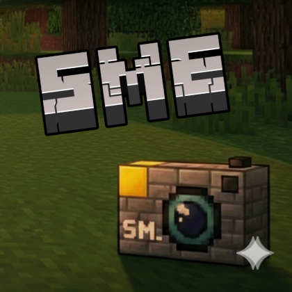
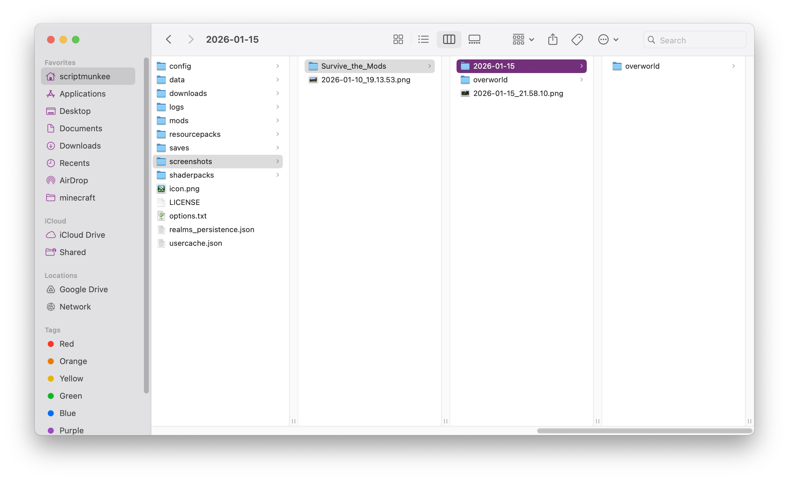
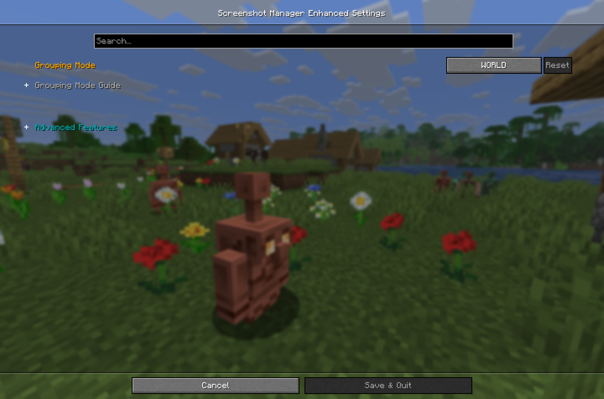
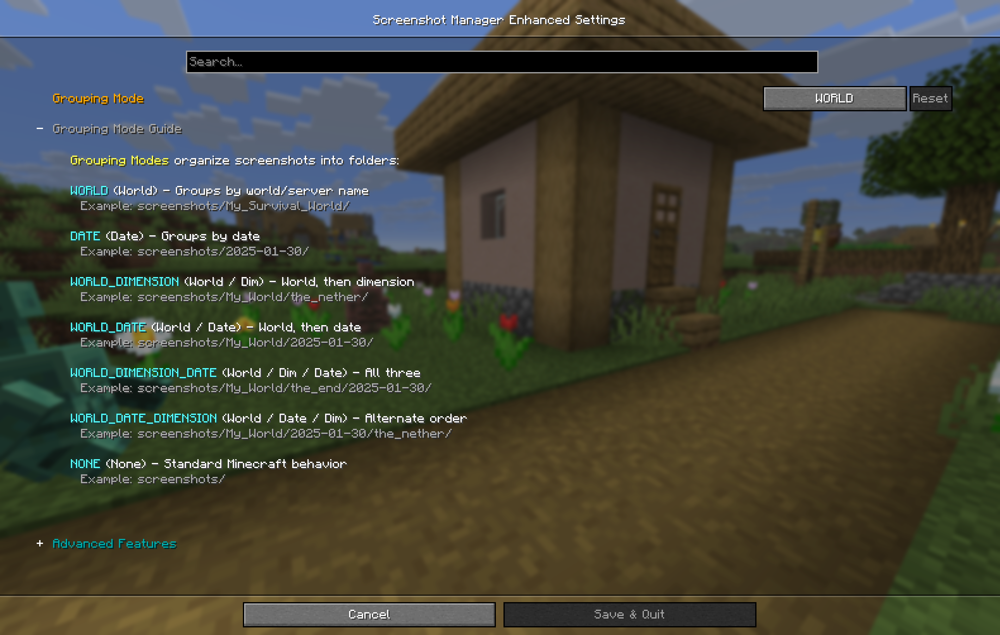
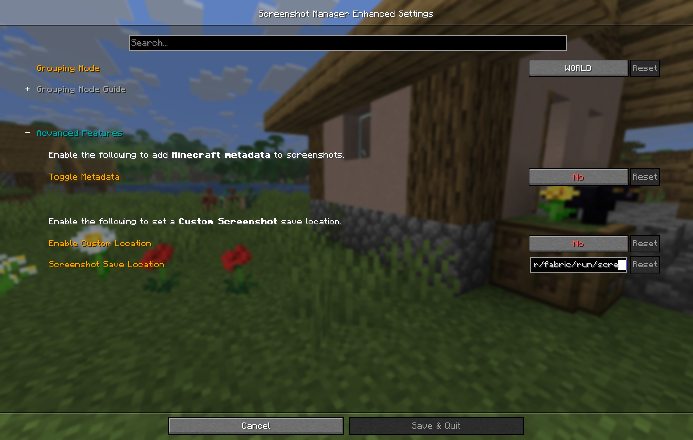
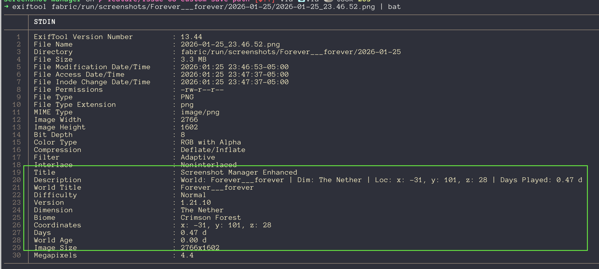

# Screenshot Manager Enhanced Gallery

Welcome to the gallery for **Screenshot Manager Enhanced**. This page showcases the key features and configuration options available in the mod, designed to help you organize your Minecraft screenshots effortlessly.

## Smart Folder Organization

Automatically group your screenshots based on the world, server, or date.

## Mod Menu Integration

Easily configure the mod directly from the in-game Mod Menu.

### General Settings

Customize how and where your screenshots are stored.

### Grouping Options

Flexible grouping modes to suit your organization style.

### Advanced Configuration

Fine-tune the behavior for power users.

## Metadata Support

Embed useful information like coordinates, world seed, and more directly into your screenshot files (XMP).

