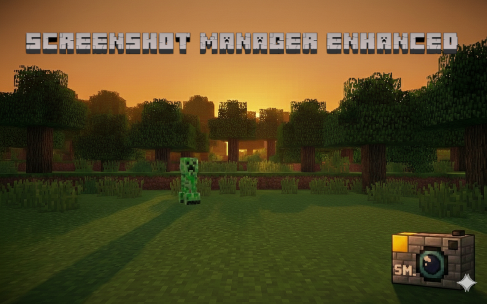

A mod designed to keep your Minecraft screenshots organized automatically. Say goodbye to a cluttered **screenshots** folder! This mod intelligently sorts your screenshots into folders based on the world, dimension, date, or a combination of these.

## ✨ Features

* **Automatic Organization**: Screenshots are instantly sorted into subfolders upon capture.
* **Per-World Configuration**: Customize settings for you single-player or specific server worlds.
* **Flexible Grouping Modes**: Customize how you want your folders structured. The mod generates paths based on your current context.
  * **`WORLD`** (Default): Groups screenshots by the world or server name.
    * Example: `screenshots/My_Survival_World/`
  * **`DATE`**: Groups screenshots by the current date (`yyyy-MM-dd`).
    * Example: `screenshots/2025-01-30/`
  * **`WORLD_DIMENSION`**: Groups by World, then by Dimension.
    * Example: `screenshots/My_Survival_World/minecraft_overworld/`
    * Example: `screenshots/My_Survival_World/minecraft_the_nether/`
  * **`WORLD_DATE`**: Groups by World, then by Date.
    * Example: `screenshots/My_Survival_World/2025-01-30/`
  * **`WORLD_DIMENSION_DATE`**: A three-level hierarchy: World -> Dimension -> Date.
    * Example: `screenshots/My_Survival_World/minecraft_the_end/2025-01-30/`
  * **`WORLD_DATE_DIMENSION`**: A three-level hierarchy: World -> Date -> Dimension.
    * Example: `screenshots/My_Survival_World/2025-01-30/minecraft_the_nether/`
  * **`NONE`**: Disables grouping. Screenshots are saved directly in the screenshots folder (standard Minecraft behavior).
    * Example: `screenshots/`

#### *Coming Soon!*

* **Metadata Support**: Optional metadata saving (configurable).
* **In-Game Config**: Fully configurable via [Mod Menu](https://modrinth.com/mod/modmenu) and [Cloth Config](https://modrinth.com/mod/cloth-config).

## 📥 Installation

#### Option 1: Modrinth (Recommended)

The easiest way to install **Screenshot Manager Enhanced** is through the Modrinth Launcher or Download from the Modrinth website.

1. Visit our [Screenshot Manager Enhanced on Modrinth](https://modrinth.com/mod/screenshot-manager-enhanced).
2. Click **Install** (if using the app) or download the version matching your Minecraft instance.
3. Ensure you have the required dependencies installed.

#### Option 2: Manual Install (GitHub)

For those who prefer the manual route:

1. **Install Fabric Loader**: Make sure you have the [Fabric Loader](https://fabricmc.net/use/installer/) installed for your version of Minecraft.
2. **Download Dependencies**: You will need the following mods:
    * [Fabric API](https://modrinth.com/mod/fabric-api)
    * [Cloth Config API](https://modrinth.com/mod/cloth-config) (Required for configuration screen)
    * [Mod Menu](https://modrinth.com/mod/modmenu) (Recommended for accessing settings)
3. **Download Mod**: Go to the [GitHub Releases](#) page and download the latest `.jar` file.
4. **Install**: Drop the `.jar` files into your `.minecraft/mods` folder.
5. **Launch**: Start Minecraft and enjoy organized screenshots!

### ⚙️ Usage & Configuration

Once installed, the mod works automatically with the default setting (Group by `WORLD`).

To change the settings:

1. Open the Pause Menu or Main Menu.
2. Click on the **Mods** button (requires Mod Menu).
3. Search for **Screenshot Manager Enhanced** and click the **Config** button.
4. **Global Settings**: default behavior for all worlds.
5. **World Overrides**: Add specifics for your favorite servers or worlds *(Coming Soon)*.

## 🤝 Contributing

We welcome contributions! If you're interested in helping improve Screenshot Manager Enhanced:

1. **Fork the Repository**: Create your own fork on GitHub.
2. **Clone**: `git clone https://github.com/milezerosoftware/screenshot-manager-enhanced.git`
3. **Make Changes**: Implement your features or fixes.
4. **Test**: Run `./gradlew runClient` to test locally.
5. **Pull Request**: Submit a PR with a clear description of your changes.

Please report any bugs or feature requests on the [Issue Tracker](https://github.com/milezerosoftware/screenshot-manager-enhanced/issues).

## 📄 License

This project is licensed under the [Apache-2.0 License](LICENSE).
