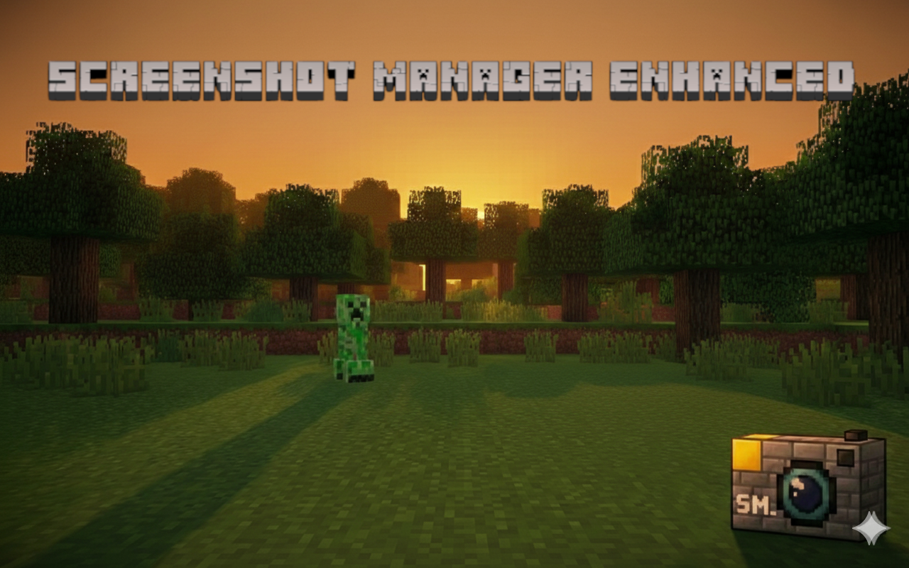

<!--  -->

A mod designed to keep your Minecraft screenshots organized automatically. Say goodbye to a cluttered **screenshots** folder! This mod intelligently sorts your screenshots into folders based on the world, dimension, date, or a combination of these.

## ✨ Features

* **Automatic Organization**: Screenshots are instantly sorted into subfolders upon capture.
* **Per-World Configuration**: Customize settings for you single-player or specific server worlds.
* **In-Game Configuration**: Fully configurable via [Mod Menu](https://modrinth.com/mod/modmenu)
* **Flexible Grouping Modes**: Customize how you want your folders structured. The mod generates paths based on your current context.
  * **`WORLD`** (Default): Groups screenshots by the world or server name.
    * Example: `screenshots/My_Survival_World/`
  * **`DATE`**: Groups screenshots by the current date (`yyyy-MM-dd`).
    * Example: `screenshots/2025-01-30/`
  * **`WORLD_DIMENSION`**: Groups by World, then by Dimension.
    * Example: `screenshots/My_Survival_World/minecraft_overworld/`
    * Example: `screenshots/My_Survival_World/minecraft_the_nether/`
  * **`WORLD_DATE`**: Groups by World, then by Date.
    * Example: `screenshots/My_Survival_World/2025-01-30/`
  * **`WORLD_DIMENSION_DATE`**: A three-level hierarchy: World -> Dimension -> Date.
    * Example: `screenshots/My_Survival_World/minecraft_the_end/2025-01-30/`
  * **`WORLD_DATE_DIMENSION`**: A three-level hierarchy: World -> Date -> Dimension.
    * Example: `screenshots/My_Survival_World/2025-01-30/minecraft_the_nether/`
  * **`NONE`**: Disables grouping. Screenshots are saved directly in the screenshots folder (standard Minecraft behavior).
    * Example: `screenshots/`

### ⚗️ Advanced Features

* **Metadata Support** 🗃️: Automatically embeds rich game details directly into the screenshot file (XMP format). This data travels with the image!
  * **World Context**: World Name, Dimension, Biome
  * **Location**: Exact X, Y, Z Coordinates
  * **Time**: In-game Days Played, World Age
  * **Game State**: Difficulty, Game Mode, Minecraft Version
* **Custom Save Location** 💾: Choose exactly where your screenshots go.
  * Override the default `.minecraft/screenshots` location.
  * Use any absolute path on your system (e.g., a shared network drive or cloud storage folder).
  * *Note: Requires enabling advanced settings validation.*

## 📥 Installation

### Option 1: Modrinth (Recommended)

The easiest way to install **Screenshot Manager Enhanced** is through the Modrinth Launcher or Download from the Modrinth website.

1. Visit our [Screenshot Manager Enhanced on Modrinth](https://modrinth.com/mod/screenshot-manager-enhanced).
2. Click **Install** (if using the app) or download the version matching your Minecraft instance.
3. Ensure you have the required dependencies installed.

## Option 2: Manual Install (GitHub)

For those who prefer the manual route:

1. **Install Fabric Loader**: Make sure you have the [Fabric Loader](https://fabricmc.net/use/installer/) installed for your version of Minecraft.
2. **Download Dependencies**: You will need the following mods:
    * [Fabric API](https://modrinth.com/mod/fabric-api)
    * [Cloth Config API](https://modrinth.com/mod/cloth-config) (Required for configuration screen)
    * [Mod Menu](https://modrinth.com/mod/modmenu) (Recommended for accessing settings)
3. **Download Mod**: Go to the [GitHub Releases](#) page and download the latest `.jar` file.
4. **Install**: Drop the `.jar` files into your `.minecraft/mods` folder.
5. **Launch**: Start Minecraft and enjoy organized screenshots!

## 🖼️ Gallery

Check out our [Gallery](Gallery.md) to see examples of:

* Grouping Modes (World, Date, Dimension)
* Metadata embedding
* Mod Menu configuration

## ⚙️ Usage & Configuration

Once installed, the mod works automatically with the default setting (Group by `WORLD`).

To change the settings:

1. Open the Pause Menu or Main Menu.
2. Click on the **Mods** button (requires Mod Menu).
3. Search for **Screenshot Manager Enhanced** and click the **Config** button.
4. **Global Settings**: default behavior for all worlds.
5. **World Overrides**: Add specifics for your favorite servers or worlds *(Coming Soon)*.

## 🤝 Contributing

We welcome contributions!

1. **Fork the Repository**
2. **Clone**: `git clone https://github.com/milezerosoftware/screenshot-manager-enhanced.git`
3. **Make Changes**: Core logic resides in `common/`. Loader-specific code is in `fabric/` (and future modules).
4. **Test**: Run `./gradlew :fabric:runClient -Pmc_ver=1.21.10` to test locally.
5. **Pull Request**: Submit a PR with a clear description of your changes.

Please report any bugs or feature requests on the [Issue Tracker](https://github.com/milezerosoftware/screenshot-manager-enhanced/issues).

### 🛠️ Building from Source

This project uses a multi-module Gradle structure to support multiple Minecraft versions.

#### Build All (Recommended)

Build all supported versions for all loaders in one command:

```bash
./gradlew buildAllAll
```

#### Build by Loader

Build all supported Minecraft versions for a specific loader:

```bash
./gradlew buildAllFabric
```

> [!TIP]
> You can discover all available loader and version tasks by running:
> `./gradlew tasks --group "build all"`

#### Planned Loader Support

Tasks for these are not yet implemented but are on the roadmap:

* **NeoForge**: `buildAllNeoForge`
* **Forge**: `buildAllForge`
* **Quilt**: `buildAllQuilt`

### Build Specific Version

To build or run for a specific Minecraft version, use the `-Pmc_ver` property:

```bash
# Build Fabric for 1.21.10
./gradlew :fabric:build -Pmc_ver=1.21.10


> [!NOTE]
> Supported Minecraft versions are defined in `versionProperties/`. Currently supported: `1.21.11` thru `1.20.5`

## 🚀 Release Process

Releases are automated via GitHub Actions. When you push a version tag, the workflow:

1. Builds all supported Minecraft versions
2. Publishes to **Modrinth** and **CurseForge**
3. Creates a **GitHub Release** with attached JARs

**Quick steps:**

``` text
┌─────────────────────────────────────────────────────────┐
│                    RELEASE WORKFLOW                     │
├─────────────────────────────────────────────────────────┤
│  1. Update CHANGELOG.md with release notes              │
│  2. Update mod_version in gradle.properties             │
│  3. git checkout -b release/X.Y.Z                       │
│  4. git add . && git commit -m "chore: release vX.Y.Z"  │
│  5. Open a PR and merge the PR                          │
│  6. git checkout main && git pull                       │
│  7. git tag vX.Y.Z                                      │
│  8. git push origin vX.Y.Z                              │
│  9. ☕ Wait ~5-10 min for builds                         │
│  10. Verify uploads on Modrinth + CurseForge            │
│  11. Publish GitHub release draft (optional)            │
└─────────────────────────────────────────────────────────┘
```

📖 **For full instructions**, see [RELEASE.md](RELEASE.md).

## 📄 License

This project is licensed under the [Apache-2.0 License](LICENSE).
